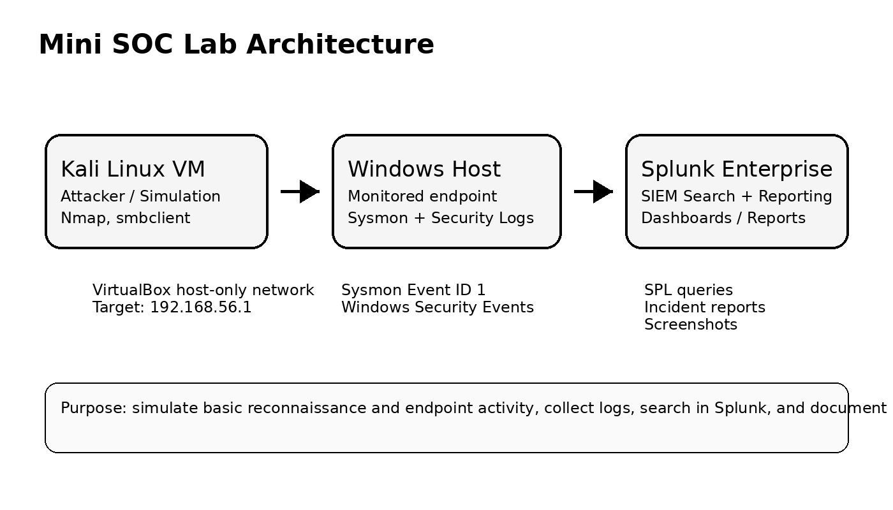
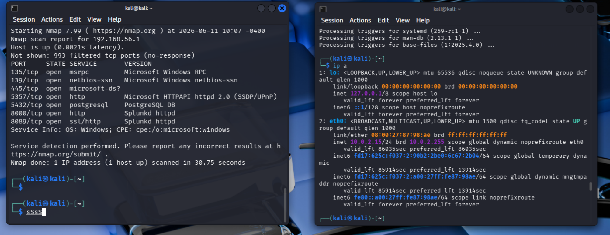
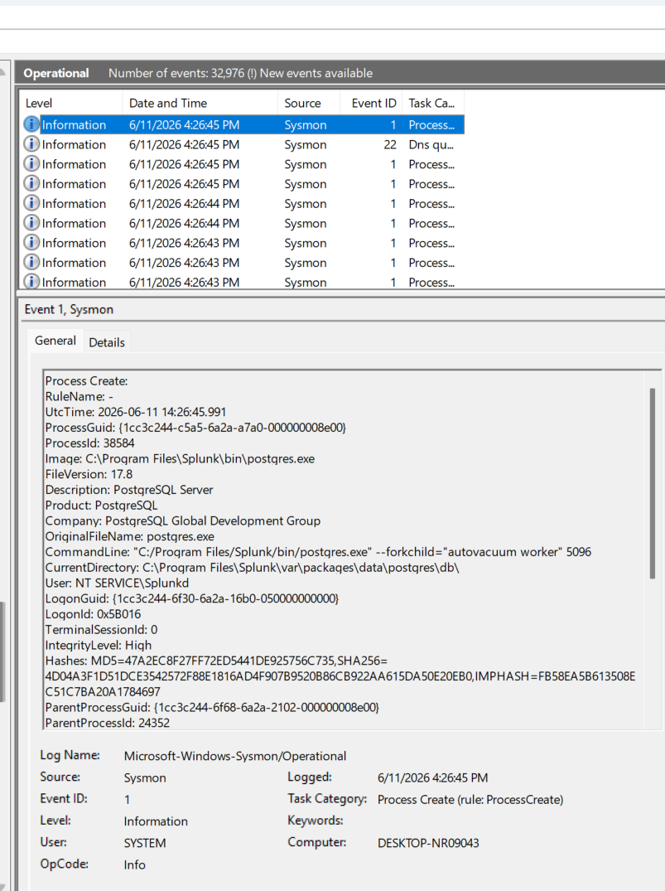
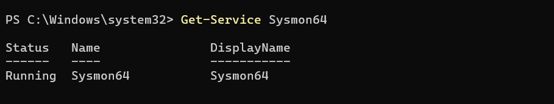
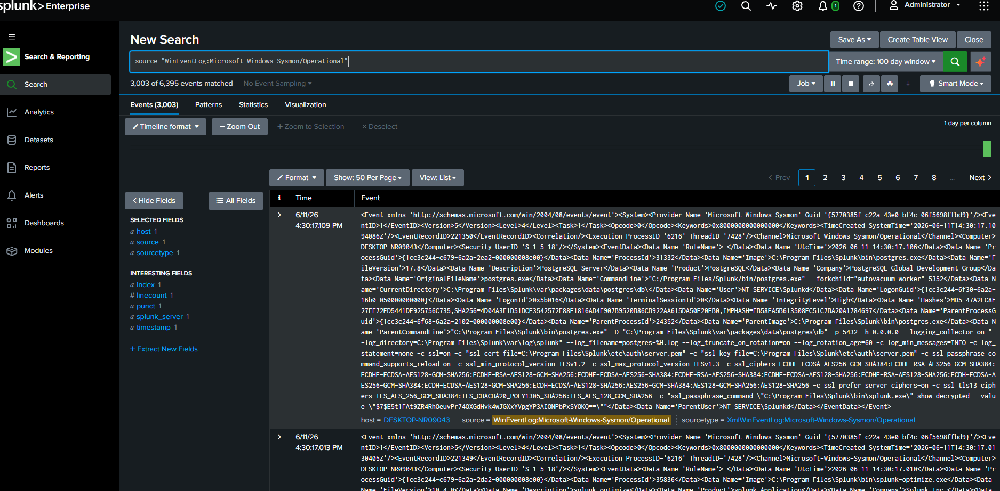
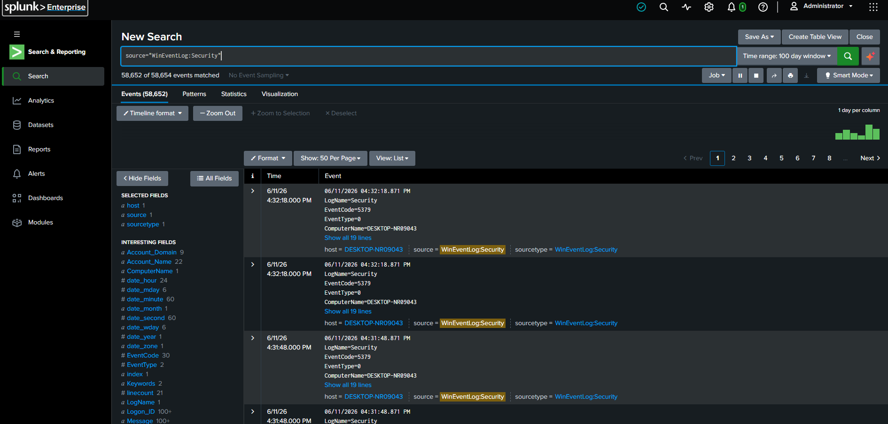
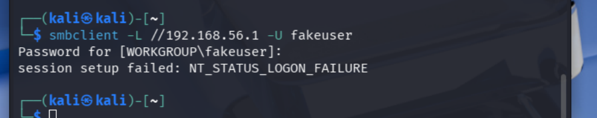
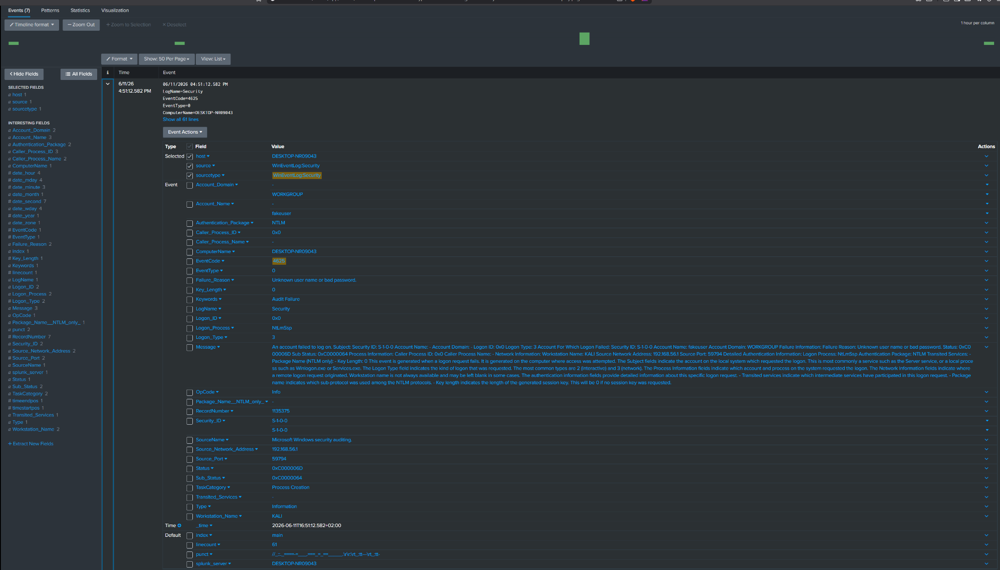

# Mini SOC Lab: Attack Detection with Splunk, Sysmon and Kali Linux

## Objective

This project is a home cybersecurity lab designed to simulate basic attack activity and detect it using Splunk, Sysmon, and Windows Security logs.

The goal is to practice SOC Analyst Level 1 workflows: log collection, detection creation, alert investigation, incident reporting, and MITRE ATT&CK mapping.

## Lab Overview

Kali Linux is used as the attacker/simulation machine. A Windows host is monitored using Sysmon and Windows Security logs. Splunk Enterprise is used to ingest, search, and analyze the events.

> Public note: IP addresses in documentation can be sanitized. The lab uses private VirtualBox host-only addressing, not a public internet IP.

## Architecture



```text
Kali Linux VM  --->  Windows Host  --->  Splunk Enterprise
Attacker           Sysmon logs          Search, detection, reporting
```

## Tools Used

- Kali Linux
- Windows
- Sysmon
- Splunk Enterprise / Splunk Free
- Nmap
- smbclient
- PowerShell
- MITRE ATT&CK

## Detection Scenarios

| Scenario | Status | Evidence |
|---|---:|---|
| Sysmon process creation logging | Completed | `screenshots/02-sysmon/` |
| Sysmon logs ingested in Splunk | Completed | `screenshots/03-splunk/` |
| PowerShell execution detection | Completed | `screenshots/04-powershell-detection/` |
| Nmap service scan simulation | Completed | `screenshots/05-nmap-scan/` |
| Windows Security log ingestion | Completed | `screenshots/03-splunk/03-splunk-security-events.png` |
| Failed login detection | Completed | `screenshots/06-failed-logins/` |

## Skills Demonstrated

- SIEM log analysis
- Windows event monitoring
- Sysmon process creation analysis
- Splunk SPL searches
- Basic attack simulation using Kali Linux
- Reconnaissance detection concepts
- Incident report writing
- MITRE ATT&CK mapping
- Technical documentation for a cybersecurity portfolio

## Key Screenshots

### Nmap service scan from Kali



### Sysmon Event ID 1 process creation



### Sysmon service running



### Sysmon logs in Splunk



### Windows Security logs in Splunk



### Failed login detection from Kali SMB attempt



### Splunk EventCode 4625 failed login details



## Repository Structure

```text
mini-soc-lab/
├── README.md
├── architecture/
├── setup/
├── detections/
├── splunk-queries/
├── incident-reports/
├── screenshots/
└── lessons-learned.md
```

## Disclaimer

This project was built in a controlled lab environment for defensive cybersecurity learning and portfolio development. No third-party systems were targeted.
