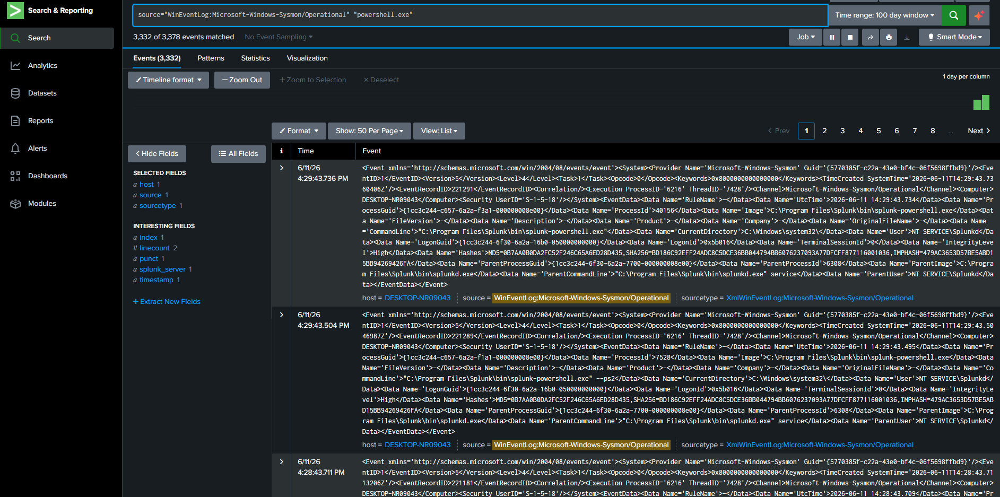

# Detection: PowerShell Execution

## Objective

Detect PowerShell process execution on the monitored Windows host using Sysmon Event ID 1 and Splunk.

## Why This Matters

PowerShell is a legitimate administration tool, but attackers often abuse it for execution, discovery, download commands, and defense evasion. Monitoring PowerShell process creation helps analysts identify suspicious activity early.

## Log Source

```text
WinEventLog:Microsoft-Windows-Sysmon/Operational
```

## Detection Query

```spl
source="WinEventLog:Microsoft-Windows-Sysmon/Operational" "powershell.exe"
```

## Improved Query

```spl
source="WinEventLog:Microsoft-Windows-Sysmon/Operational" "powershell.exe"
| table _time host source sourcetype _raw
```

## Evidence



## MITRE ATT&CK Mapping

| Technique | Name |
|---|---|
| T1059.001 | Command and Scripting Interpreter: PowerShell |

## Analyst Notes

Sysmon process creation logs were successfully ingested into Splunk. PowerShell-related process execution was searchable from the Sysmon Operational log source.

## Recommended Remediation / Monitoring

- Enable PowerShell logging
- Monitor suspicious PowerShell flags such as `-NoProfile`, `-ExecutionPolicy Bypass`, `-EncodedCommand`, and hidden windows
- Review parent process relationships
- Investigate PowerShell launched from unusual parent processes
